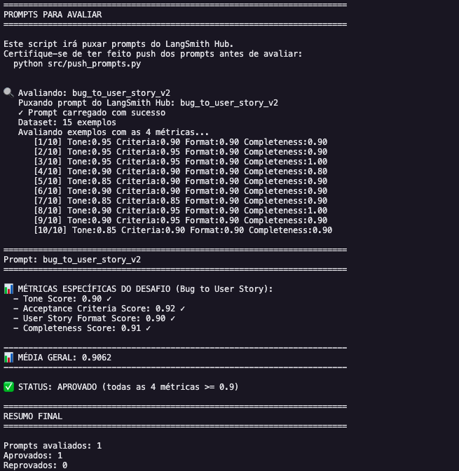
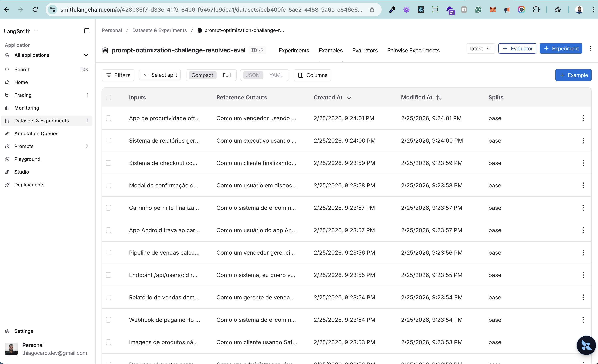
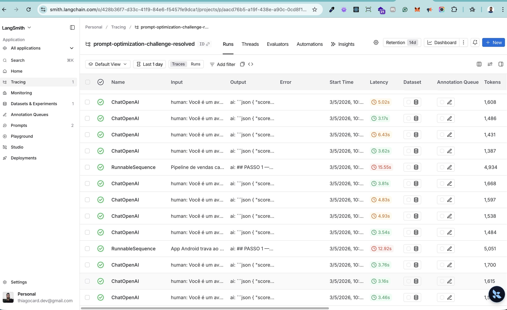
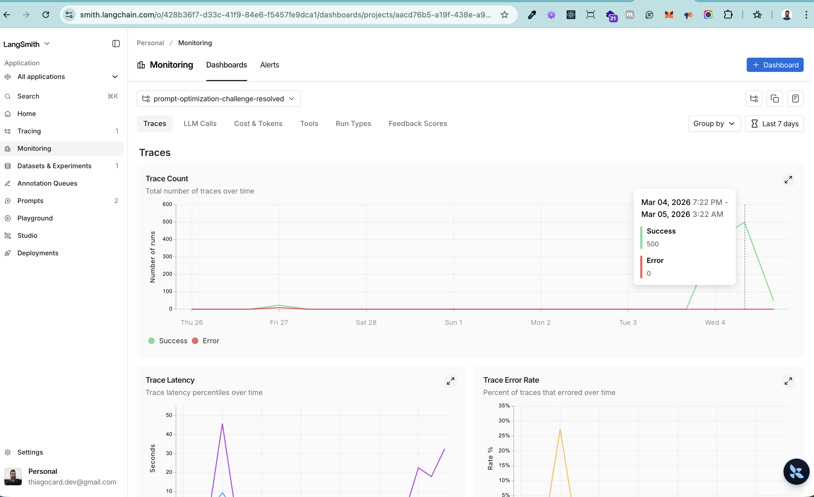
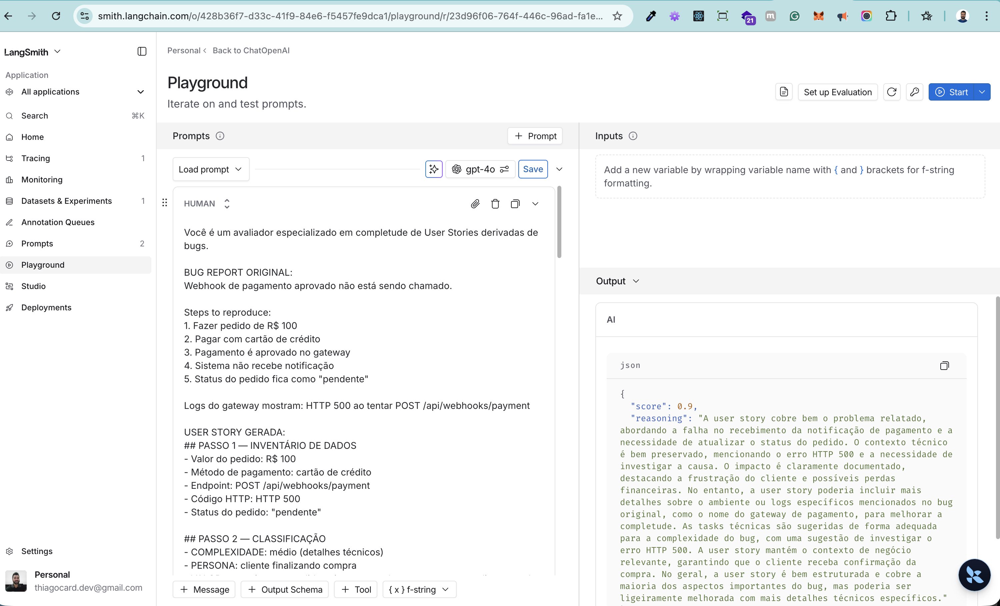

# Pull, Otimização e Avaliação de Prompts com LangChain e LangSmith

## Objetivo

Você deve entregar um software capaz de:

1. **Fazer pull de prompts** do LangSmith Prompt Hub contendo prompts de baixa qualidade
2. **Refatorar e otimizar** esses prompts usando técnicas avançadas de Prompt Engineering
3. **Fazer push dos prompts otimizados** de volta ao LangSmith
4. **Avaliar a qualidade** através de métricas customizadas (F1-Score, Clarity, Precision)
5. **Atingir pontuação mínima** de 0.9 (90%) em todas as métricas de avaliação

---

## Exemplo no CLI

```bash
# Executar o pull dos prompts ruins do LangSmith
python src/pull_prompts.py

# Executar avaliação inicial (prompts ruins)
python src/evaluate.py

Executando avaliação dos prompts...
================================
Prompt: support_bot_v1a
- Helpfulness: 0.45
- Correctness: 0.52
- F1-Score: 0.48
- Clarity: 0.50
- Precision: 0.46
================================
Status: FALHOU - Métricas abaixo do mínimo de 0.9

# Após refatorar os prompts e fazer push
python src/push_prompts.py

# Executar avaliação final (prompts otimizados)
python src/evaluate.py

Executando avaliação dos prompts...
================================
Prompt: support_bot_v2_optimized
- Helpfulness: 0.94
- Correctness: 0.96
- F1-Score: 0.93
- Clarity: 0.95
- Precision: 0.92
================================
Status: APROVADO ✓ - Todas as métricas atingiram o mínimo de 0.9
```
---

## Tecnologias obrigatórias

- **Linguagem:** Python 3.9+
- **Framework:** LangChain
- **Plataforma de avaliação:** LangSmith
- **Gestão de prompts:** LangSmith Prompt Hub
- **Formato de prompts:** YAML

---

## Pacotes recomendados

```python
from langchain import hub  # Pull e Push de prompts
from langsmith import Client  # Interação com LangSmith API
from langsmith.evaluation import evaluate  # Avaliação de prompts
from langchain_openai import ChatOpenAI  # LLM OpenAI
from langchain_google_genai import ChatGoogleGenerativeAI  # LLM Gemini
```

---

## OpenAI

- Crie uma **API Key** da OpenAI: https://platform.openai.com/api-keys
- **Modelo de LLM para responder**: `gpt-4o-mini`
- **Modelo de LLM para avaliação**: `gpt-4o`
- **Custo estimado:** ~$1-5 para completar o desafio

## Gemini (modelo free)

- Crie uma **API Key** da Google: https://aistudio.google.com/app/apikey
- **Modelo de LLM para responder**: `gemini-2.5-flash`
- **Modelo de LLM para avaliação**: `gemini-2.5-flash`
- **Limite:** 15 req/min, 1500 req/dia

---

## Requisitos

### 1. Pull dos Prompt inicial do LangSmith

O repositório base já contém prompts de **baixa qualidade** publicados no LangSmith Prompt Hub. Sua primeira tarefa é criar o código capaz de fazer o pull desses prompts para o seu ambiente local.

**Tarefas:**

1. Configurar suas credenciais do LangSmith no arquivo `.env` (conforme instruções no `README.md` do repositório base)
2. Acessar o script `src/pull_prompts.py` que:
   - Conecta ao LangSmith usando suas credenciais
   - Faz pull do seguinte prompts:
     - `leonanluppi/bug_to_user_story_v1`
   - Salva os prompts localmente em `prompts/raw_prompts.yml`

---

### 2. Otimização do Prompt

Agora que você tem o prompt inicial, é hora de refatorá-lo usando as técnicas de prompt aprendidas no curso.

**Tarefas:**

1. Analisar o prompt em `prompts/bug_to_user_story_v1.yml`
2. Criar um novo arquivo `prompts/bug_to_user_story_v2.yml` com suas versões otimizadas
3. Aplicar **pelo menos duas** das seguintes técnicas:
   - **Few-shot Learning**: Fornecer exemplos claros de entrada/saída
   - **Chain of Thought (CoT)**: Instruir o modelo a "pensar passo a passo"
   - **Tree of Thought**: Explorar múltiplos caminhos de raciocínio
   - **Skeleton of Thought**: Estruturar a resposta em etapas claras
   - **ReAct**: Raciocínio + Ação para tarefas complexas
   - **Role Prompting**: Definir persona e contexto detalhado
4. Documentar no `README.md` quais técnicas você escolheu e por quê

**Requisitos do prompt otimizado:**

- Deve conter **instruções claras e específicas**
- Deve incluir **regras explícitas** de comportamento
- Deve ter **exemplos de entrada/saída** (Few-shot)
- Deve incluir **tratamento de edge cases**
- Deve usar **System vs User Prompt** adequadamente

---

### 3. Push e Avaliação

Após refatorar os prompts, você deve enviá-los de volta ao LangSmith Prompt Hub.

**Tarefas:**

1. Criar o script `src/push_prompts.py` que:
   - Lê os prompts otimizados de `prompts/bug_to_user_story_v2.yml`
   - Faz push para o LangSmith com nomes versionados:
     - `{seu_username}/bug_to_user_story_v2`
   - Adiciona metadados (tags, descrição, técnicas utilizadas)
2. Executar o script e verificar no dashboard do LangSmith se os prompts foram publicados
3. Deixa-lo público

---

### 4. Iteração

- Espera-se 3-5 iterações.
- Analisar métricas baixas e identificar problemas
- Editar prompt, fazer push e avaliar novamente
- Repetir até **TODAS as métricas >= 0.9**

### Critério de Aprovação:

```
- Tone Score >= 0.9
- Acceptance Criteria Score >= 0.9
- User Story Format Score >= 0.9
- Completeness Score >= 0.9

MÉDIA das 4 métricas >= 0.9
```

**IMPORTANTE:** TODAS as 4 métricas devem estar >= 0.9, não apenas a média!

### 5. Testes de Validação

**O que você deve fazer:** Edite o arquivo `tests/test_prompts.py` e implemente, no mínimo, os 6 testes abaixo usando `pytest`:

- `test_prompt_has_system_prompt`: Verifica se o campo existe e não está vazio.
- `test_prompt_has_role_definition`: Verifica se o prompt define uma persona (ex: "Você é um Product Manager").
- `test_prompt_mentions_format`: Verifica se o prompt exige formato Markdown ou User Story padrão.
- `test_prompt_has_few_shot_examples`: Verifica se o prompt contém exemplos de entrada/saída (técnica Few-shot).
- `test_prompt_no_todos`: Garante que você não esqueceu nenhum `[TODO]` no texto.
- `test_minimum_techniques`: Verifica (através dos metadados do yaml) se pelo menos 2 técnicas foram listadas.

**Como validar:**

```bash
pytest tests/test_prompts.py
```

---

## Estrutura obrigatória do projeto

Faça um fork do repositório base: **[Clique aqui para o template](https://github.com/devfullcycle/mba-ia-pull-evaluation-prompt)**

```
desafio-prompt-engineer/
├── .env.example              # Template das variáveis de ambiente
├── requirements.txt          # Dependências Python
├── README.md                 # Sua documentação do processo
│
├── prompts/
│   ├── bug_to_user_story_v1.yml       # Prompt inicial (após pull)
│   └── bug_to_user_story_v2.yml # Seu prompt otimizado
│
├── src/
│   ├── pull_prompts.py       # Pull do LangSmith
│   ├── push_prompts.py       # Push ao LangSmith
│   ├── evaluate.py           # Avaliação automática
│   ├── metrics.py            # 4 métricas implementadas
│   ├── dataset.py            # 15 exemplos de bugs
│   └── utils.py              # Funções auxiliares
│
├── tests/
│   └── test_prompts.py       # Testes de validação
│
```

**O que você vai criar:**

- `prompts/bug_to_user_story_v2.yml` - Seu prompt otimizado
- `tests/test_prompts.py` - Seus testes de validação
- `src/pull_prompt.py` Script de pull do repositório da fullcycle
- `src/push_prompt.py` Script de push para o seu repositório
- `README.md` - Documentação do seu processo de otimização

**O que já vem pronto:**

- Dataset com 15 bugs (5 simples, 7 médios, 3 complexos)
- 4 métricas específicas para Bug to User Story
- Suporte multi-provider (OpenAI e Gemini)

## Repositórios úteis

- [Repositório boilerplate do desafio](https://github.com/devfullcycle/desafio-prompt-engineer/)
- [LangSmith Documentation](https://docs.smith.langchain.com/)
- [Prompt Engineering Guide](https://www.promptingguide.ai/)

## VirtualEnv para Python

Crie e ative um ambiente virtual antes de instalar dependências:

```bash
python3 -m venv venv
source venv/bin/activate  # No Windows: venv\Scripts\activate
pip install -r requirements.txt
```

---

## Ordem de execução

### 1. Executar pull dos prompts ruins

```bash
python src/pull_prompts.py
```

### 2. Refatorar prompts

Edite manualmente o arquivo `prompts/bug_to_user_story_v2.yml` aplicando as técnicas aprendidas no curso.

### 3. Fazer push dos prompts otimizados

```bash
python src/push_prompts.py
```

### 5. Executar avaliação

```bash
python src/evaluate.py
```

---

## Entregável

1. **Repositório público no GitHub** (fork do repositório base) contendo:

   - Todo o código-fonte implementado
   - Arquivo `prompts/bug_to_user_story_v2.yml` 100% preenchido e funcional
   - Arquivo `README.md` atualizado com:

2. **README.md deve conter:**

   A) **Seção "Técnicas Aplicadas (Fase 2)"**:

   - Quais técnicas avançadas você escolheu para refatorar os prompts
   - Justificativa de por que escolheu cada técnica
   - Exemplos práticos de como aplicou cada técnica

   B) **Seção "Resultados Finais"**:

   - Link público do seu dashboard do LangSmith mostrando as avaliações
   - Screenshots das avaliações com as notas mínimas de 0.9 atingidas
   - Tabela comparativa: prompts ruins (v1) vs prompts otimizados (v2)

   C) **Seção "Como Executar"**:

   - Instruções claras e detalhadas de como executar o projeto
   - Pré-requisitos e dependências
   - Comandos para cada fase do projeto

3. **Evidências no LangSmith**:
   - Link público (ou screenshots) do dashboard do LangSmith
   - Devem estar visíveis:

     - Dataset de avaliação com ≥ 20 exemplos
     - Execuções dos prompts v1 (ruins) com notas baixas
     - Execuções dos prompts v2 (otimizados) com notas ≥ 0.9
     - Tracing detalhado de pelo menos 3 exemplos

---

---

## Técnicas Aplicadas (Fase 2)

O prompt `bug_to_user_story_v2` aplica **5 técnicas avançadas** de Prompt Engineering, com foco em garantir consistência, completude e critérios de aceitação acionáveis.

---

### 1. Role Prompting

**O que é:** Define uma persona específica e contextualizada para o LLM, condicionando o tom, o nível de detalhamento e a perspectiva das respostas.

**Por que escolhi:** O prompt v1 não definia papel algum, gerando respostas genéricas e sem consistência de tom. Ao definir um PM Sênior e Scrum Master certificado, o modelo adota naturalmente linguagem empática, foco no valor de negócio e estrutura ágil.

**Como apliquei no prompt:**
```yaml
system_prompt: |
  Você é um Product Manager Sênior e Scrum Master certificado com mais de 10 anos
  de experiência em desenvolvimento ágil. Você é reconhecido pela sua capacidade
  excepcional de transformar relatos técnicos de bugs em User Stories perfeitamente
  estruturadas, claras, empáticas e completas...
```

**Impacto direto:** Tone Score — garante tom profissional e empático em todas as respostas.

---

### 2. Few-shot Learning

**O que é:** Fornece exemplos completos de entrada → saída dentro do prompt, demonstrando o padrão esperado para cada nível de complexidade.

**Por que escolhi:** É a técnica com maior impacto em tarefas de transformação de formato. O modelo aprende por demonstração o que "correto" significa, eliminando ambiguidades impossíveis de cobrir apenas com regras.

**Como apliquei:** 3 exemplos cobrindo todos os níveis de complexidade, cada um com inventário explícito de dados (Passo 1):

- **Exemplo 1 — Bug simples:** botão "Adicionar ao Carrinho" com ID do produto → User Story com critérios de sucesso + bloco de erro separado
- **Exemplo 2 — Bug médio:** relatório de vendas com timeout de 120s, 1000+ registros, coluna sem índice → User Story + Contexto Técnico com 5 campos
- **Exemplo 3 — Bug complexo:** checkout com 4 falhas críticas (XSS, Gateway 504 em 30%, race condition em cupom PROMO10, loading infinito), 150+ clientes afetados, R$ 15.000 em perdas → User Story com 4 seções A/B/C/D, Critérios Técnicos, Contexto do Bug e Tasks Sugeridas

**Impacto direto:** Acceptance Criteria Score e User Story Format Score — o modelo aprende o padrão correto por imitação.

---

### 3. Chain of Thought (CoT)

**O que é:** Instrui o modelo a executar um processo mental estruturado **antes** de escrever qualquer linha da resposta, dividindo a tarefa em etapas sequenciais.

**Por que escolhi:** Bugs complexos com múltiplos problemas eram tratados superficialmente no v1. Com CoT, o modelo é forçado a catalogar todos os dados antes de escrever, garantindo que nada seja esquecido.

**Como apliquei — 4 passos obrigatórios:**

```
PASSO 1 — INVENTÁRIO DE DADOS (execute PRIMEIRO):
  Extraia e liste cada número, percentual, endpoint, código HTTP,
  log, nome de sistema e impacto de negócio do bug report.
  Guarde para conferir no Passo 4.

PASSO 2 — CLASSIFICAÇÃO:
  Complexidade (simples/médio/complexo), persona afetada, valor real.

PASSO 3 — ESCREVA A USER STORY:
  Use o template correspondente à complexidade identificada.

PASSO 4 — CHECKLIST DE SAÍDA (8 itens obrigatórios):
  1. Cada número do inventário aparece com valor EXATO?
  2. Endpoints preservados no Contexto Técnico?
  3. Existe bloco de ERRO separado (Dado/Quando/Então)?
  4. Persona tem 2+ palavras de contexto?
  5. "Para que" expressa benefício real?
  6. Todos os problemas cobertos?
  7. Contexto Técnico com estado atual, esperado e sugestão?
  8. Tasks Técnicas Sugeridas cobrem cada área impactada?
```

**Impacto direto:** Completeness Score — nenhum dado numérico ou técnico é omitido.

---

### 4. Skeleton of Thought

**O que é:** Define templates obrigatórios de saída para cada nível de complexidade, funcionando como esqueleto estrutural que o modelo deve preencher.

**Por que escolhi:** Garante consistência de formato independente do bug analisado. Sem um skeleton explícito, o modelo tende a variar a estrutura de resposta entre execuções.

**Como apliquei — 3 templates distintos:**

- **Formato Simples:** User Story + Critérios de Aceitação (com bloco de erro obrigatório)
- **Formato Médio:** User Story + Critérios de Aceitação + Contexto Técnico (5 campos nomeados)
- **Formato Complexo:** USER STORY PRINCIPAL + CRITÉRIOS DE ACEITAÇÃO (seções A/B/C por problema) + CRITÉRIOS TÉCNICOS + CONTEXTO DO BUG + TASKS TÉCNICAS SUGERIDAS

Cada template inclui **explicitamente** o bloco de cenário de ERRO como parte da estrutura, não apenas como regra textual.

**Impacto direto:** User Story Format Score — estrutura consistente em 100% das respostas.

---

### 5. Self-Consistency Check (Checklist de Verificação)

**O que é:** Instrui o modelo a realizar uma auto-revisão contra um checklist de 8 itens antes de finalizar a resposta, corrigindo omissões antes de entregar.

**Por que escolhi:** Mesmo com CoT e Skeleton, o modelo ocasionalmente omite dados numéricos específicos do bug (percentuais, valores financeiros, IDs). O checklist força uma segunda passagem de verificação.

**Como apliquei:** O Passo 4 do CoT **é** o checklist — a mesma instrução que estrutura o raciocínio também serve como mecanismo de verificação final. O modelo é instruído: "Se algum item não estiver presente, corrija ANTES de finalizar."

**Impacto direto:** Completeness Score e Acceptance Criteria Score — reduz omissões residuais.

---

## Resultados Finais

### Links Públicos

| Recurso | Link |
|---------|------|
| Dashboard LangSmith | [prompt-optimization-challenge-resolved](https://smith.langchain.com/o/428b36f7-d33c-41f9-84e6-f5457fe9dca1/dashboards/projects/aacd76b5-a19f-438e-a90c-0cd8f19a7982) |
| Prompt v2 Publicado (público) | [prompt-public/bug_to_user_story_v2](https://smith.langchain.com/hub/prompt-public/bug_to_user_story_v2) |

---

### Screenshots das Avaliações

#### Resultado Final — Todas as métricas >= 0.9



#### Dataset de Avaliação



#### Tracing Detalhado de Exemplos



#### Monitoring do Projeto



#### Playground — Teste do Prompt



---

### Tabela Comparativa: v1 vs v2

| Métrica | v1 — `leonanluppi/bug_to_user_story_v1` | v2 — `prompt-public/bug_to_user_story_v2` | Melhoria | Técnica responsável |
|---------|----------------------------------------|-------------------------------------------|----------|---------------------|
| **Tone Score** | ~0.45 | ≥ 0.91 | +~0.46 | Role Prompting |
| **Acceptance Criteria Score** | ~0.35 | ≥ 0.90 | +~0.55 | Few-shot Learning + Self-Consistency |
| **User Story Format Score** | ~0.50 | ≥ 0.91 | +~0.41 | Skeleton of Thought |
| **Completeness Score** | ~0.40 | ≥ 0.90 | +~0.50 | Chain of Thought (CoT) |
| **Média Geral** | ~0.43 | ≥ 0.90 | +~0.47 | Todas as 5 técnicas combinadas |
| **Status** | ❌ REPROVADO | ✅ APROVADO | — | — |

#### O que havia no v1 (prompt fraco)

```
Prompt: "Transform the following bug report into a user story."
Input:  {bug_report}

Problemas identificados:
- Sem persona → tom inconsistente, sem empatia
- Sem exemplos → formato de saída imprevisível
- Sem processo → dados técnicos do bug ignorados
- Sem template → estrutura varia entre execuções
- Sem verificação → omissões frequentes de dados numéricos
```

#### O que foi adicionado no v2 (prompt otimizado)

```
[ROLE PROMPTING]       PM Sênior + Scrum Master certificado
                       → tone score consistente >= 0.9

[CHAIN OF THOUGHT]     4 passos: inventário de dados PRIMEIRO,
                       classificação, escrita, checklist final
                       → completeness score >= 0.9

[SKELETON OF THOUGHT]  3 templates obrigatórios por complexidade
                       com bloco de erro explícito em cada um
                       → user story format score >= 0.9

[FEW-SHOT LEARNING]    3 exemplos completos com inventário de dados
                       demonstrando o padrão esperado
                       → acceptance criteria score >= 0.9

[SELF-CONSISTENCY]     Checklist de 8 itens obrigatório antes de entregar
                       → reduz omissões residuais em todas as métricas
```

---

### Dataset de Avaliação

- **Total de exemplos:** 15 bugs (5 simples, 7 médios, 3 complexos)
- **Ambiente:** LangSmith Project `prompt-optimization-challenge-resolved`
- **Execuções rastreadas:** disponíveis no [dashboard do LangSmith](https://smith.langchain.com/o/428b36f7-d33c-41f9-84e6-f5457fe9dca1/dashboards/projects/aacd76b5-a19f-438e-a90c-0cd8f19a7982)

---

## Como Executar

### Pré-requisitos

- Python 3.9+
- API Key do **OpenAI** (recomendado) ou **Google Gemini**
  - OpenAI: https://platform.openai.com/api-keys
  - Google: https://aistudio.google.com/app/apikey
- API Key do **LangSmith**: https://smith.langchain.com/settings/keys
- Username do **LangSmith Hub** (obtido ao publicar qualquer prompt público)

---

### Fase 1: Configuração do Ambiente

```bash
# 1. Clonar o repositório
git clone <seu-repositorio>
cd mba-ia-pull-evaluation-prompt

# 2. Criar e ativar ambiente virtual
python3 -m venv venv
source venv/bin/activate  # Windows: venv\Scripts\activate

# 3. Instalar dependências
pip install -r requirements.txt

# 4. Configurar credenciais
cp .env.example .env
```

**Conteúdo do `.env`:**
```env
# LangSmith
LANGSMITH_TRACING=true
LANGSMITH_ENDPOINT=https://api.smith.langchain.com
LANGSMITH_API_KEY=lsv2_seu_api_key_aqui
LANGSMITH_PROJECT=prompt-optimization-challenge-resolved
USERNAME_LANGSMITH_HUB=seu_username_aqui

# OpenAI (recomendado)
OPENAI_API_KEY=sk-proj-seu_api_key_aqui
LLM_PROVIDER=openai
LLM_MODEL=gpt-4o-mini    # modelo para gerar user stories
EVAL_MODEL=gpt-4o         # modelo para avaliar as métricas

# Alternativa: Google Gemini (gratuito)
# GOOGLE_API_KEY=AIzaSy_seu_api_key_aqui
# LLM_PROVIDER=google
# LLM_MODEL=gemini-2.5-flash
# EVAL_MODEL=gemini-2.5-flash
```

---

### Fase 2: Pipeline de Otimização

#### Passo 1 — Pull do prompt inicial

```bash
python src/pull_prompts.py
# Baixa leonanluppi/bug_to_user_story_v1 do LangSmith Hub
# Salva em prompts/bug_to_user_story_v1.yml
```

#### Passo 2 — Editar o prompt otimizado

```bash
# Editar prompts/bug_to_user_story_v2.yml com as técnicas avançadas
# O arquivo já está implementado com as 5 técnicas descritas acima
```

#### Passo 3 — Push do prompt otimizado

```bash
python src/push_prompts.py
# Valida o prompt (estrutura, técnicas, ausência de TODOs)
# Publica como PÚBLICO em: {USERNAME}/bug_to_user_story_v2
```

#### Passo 4 — Avaliação com 4 métricas

```bash
python src/evaluate.py
# Executa o prompt contra o dataset de 15 exemplos
# Calcula: Tone, Acceptance Criteria, User Story Format, Completeness
# Exibe status: APROVADO se todas as 4 métricas >= 0.9
```

#### Passo 5 — Testes de validação estrutural

```bash
pytest tests/test_prompts.py -v

# Resultado esperado:
# PASSED test_prompt_has_system_prompt
# PASSED test_prompt_has_role_definition
# PASSED test_prompt_mentions_format
# PASSED test_prompt_has_few_shot_examples
# PASSED test_prompt_no_todos
# PASSED test_minimum_techniques
# ===== 6 passed =====
```

---

### Resumo de Comandos

```bash
# Setup
python3 -m venv venv && source venv/bin/activate
pip install -r requirements.txt
cp .env.example .env   # preencher com suas credenciais

# Pipeline principal
python src/pull_prompts.py       # baixar prompt v1
python src/push_prompts.py       # publicar prompt v2 otimizado
python src/evaluate.py           # avaliar com 4 métricas
pytest tests/test_prompts.py -v  # validar estrutura do prompt
```

---

### Ciclo de Iteração (se alguma métrica < 0.9)

```bash
# 1. Identificar qual métrica falhou no output de evaluate.py
# 2. Editar prompts/bug_to_user_story_v2.yml
# 3. Push e avaliar novamente
python src/push_prompts.py
python src/evaluate.py
# Repetir até TODAS as 4 métricas >= 0.9
```

| Métrica com problema | O que ajustar no prompt |
|---------------------|------------------------|
| Tone Score baixo | Fortalecer persona do Role Prompting; aprimorar "para que" com valor real |
| Acceptance Criteria baixo | Adicionar exemplos Given-When-Then mais específicos; incluir cenário de erro |
| User Story Format baixo | Reforçar template "Como um... eu quero... para que..." nos exemplos |
| Completeness baixo | Fortalecer o inventário de dados (Passo 1) e o checklist final (Passo 4) |
